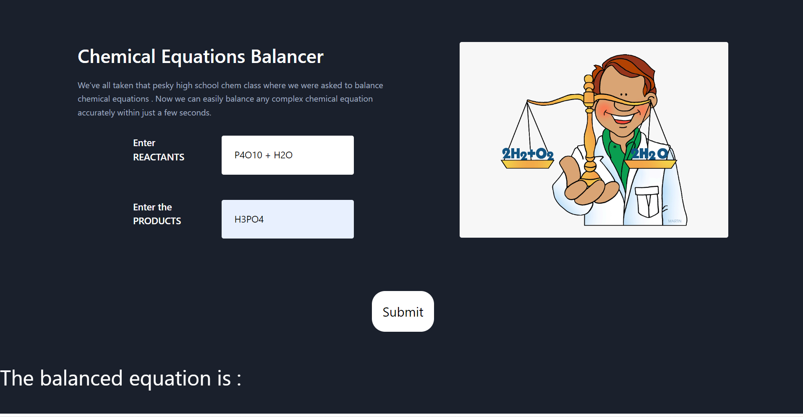
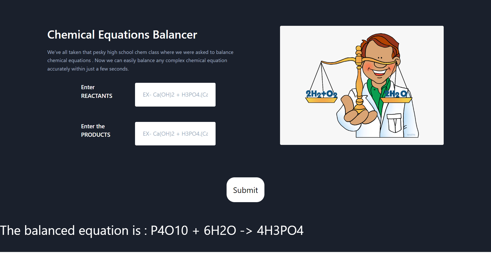

# Equation_Balancer
We’ve all taken that pesky high school chem class where we were asked to balance chemical equations . Now we can easily balance any complex chemical equation accurately within just a few seconds. This project presents a screen & allows to add products & reactants. Upon submission of the form, it balances the equation & renders the result back to the page.

# Add the equation : 

# Submit the form & get balanced equation

# Pre-Requirement

- Python
- pip

# How to run the Application

Set Up a Virtual Environment https://docs.python.org/3/library/venv.html

- Install the requirements : 
    - pip install -r requirements.txt

- Migrate Project Model to the Database. Run following commands in order :  
    - python manage.py makemigrations
    - python manage.py migrate

- Run the Project 
    - python manage.py runserver

- Test Equations : 
    - CO2 + H2O → C6H12O6 + O2
    - SiCl4 + H2O → H4SiO4 + HCl
    - Al + HCl → AlCl3 + H2
    - Na2CO3 + HCl → NaCl + H2O + CO2
    - C7H6O2 + O2 → CO2 + H2O

- To know more about approach followed , please refer to this video demonstrating equation balancing using matrices. Link : https://www.youtube.com/watch?v=yCxDAj87W8M
